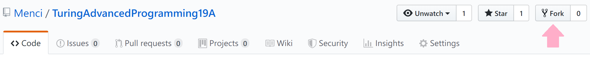
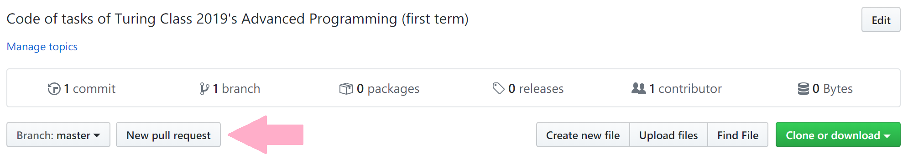
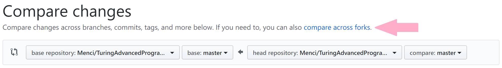

# Turing Class 2019's Advanced Programming (first term)
[Chinese](README.zh.md) | English

This is the GitHub repository for Turing Class 2019's Advanced Programming lecture's tasks. Please fork it to your account and submit to the main repository with Pull Request.

Firstly, configure the SSH key with GitHub's offcial tutorial [Generating a new SSH key](https://help.github.com/en/articles/generating-a-new-ssh-key-and-adding-it-to-the-ssh-agent) and [Adding a new SSH key to your GitHub account](https://help.github.com/en/articles/adding-a-new-ssh-key-to-your-github-account). Execute `ssh git@github.com` and you're successful if the output is like this:

```
$ ssh git@github.com
The authenticity of host 'github.com (13.250.177.223)' can't be established.
RSA key fingerprint is SHA256:nThbg6kXUpJWGl7E1IGOCspRomTxdCARLviKw6E5SY8.
Are you sure you want to continue connecting (yes/no/[fingerprint])? yes
Warning: Permanently added 'github.com,13.250.177.223' (RSA) to the list of known hosts.
Hi Menci! You've successfully authenticated, but GitHub does not provide shell access.
Connection to github.com closed.
```

Click here to fork the main repository to your account:

<center></center>

After forking, open `https://github.com/USER/TuringAdvancedProgramming19A` (replace `USER` with your username, the same below) to view your repository.

We'll need the `git` command-line utility, which can be installed via this command on Ubuntu (on other distributions and systems please refer to its document):

```bash
sudo apt install git -y
```

Download the repository to local with this command (A folder named `TuringAdvancedProgramming19A` will be created in current directory):

```bash
git clone git@github.com:USER/TuringAdvancedProgramming19A.git
```

Create a folder with the name of your student ID and real name (e.g. `2019114514张三`) in the corresponding task directory (e.g. `Task 0`) and put your files to upload there. Use this command to commit your changes to the local `git`:

```bash
# cd "TuringAdvancedProgramming19A/Task 0/"
git add 2019114514张三
git commit
```

Enter the commit message (non-empty), then save and exit the editor to finish committing locally. Push the commit to the remote with this command:

```bash
git push
```

You're successful if the output is like this:

```bash
$ git push
Enumerating objects: 4, done.
Counting objects: 100% (4/4), done.
Delta compression using up to 4 threads
Compressing objects: 100% (4/4), done.
Writing objects: 100% (4/4), 2.57 KiB | 97.00 KiB/s, done.
Total 4 (delta 0), reused 0 (delta 0)
To github.com:Menci/TuringAdvancedProgramming19A.git
 + bdd68d8...1efda49 master -> master
```

Finally click here to create a Pull Request to me on GitHub:

<center></center>

Click "compare across forks" in the next page, then choose the main repository (`Menci/TuringAdvancedProgramming19A`) on the left and your repository on the right:

<center></center>

Enter the title and content (can be empty) and click "Create pull request" on the bottom. Your code will be merged to the main repository after a review.
